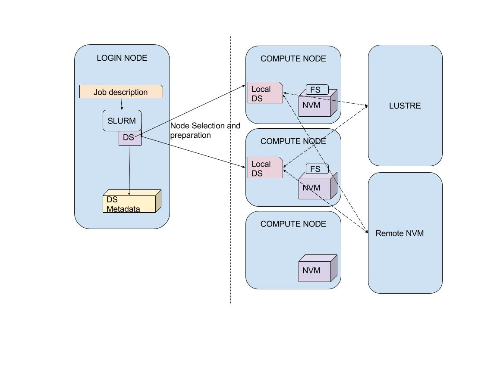

Data Scheduler
==============

The Data Scheduler (DS) is designed to work together with the Job 
Scheduler to allow for energy efficient and time efficient job
execution. The main purpose of the Data Scheduler is to manage 
the transfer of data to nodes in preparation for the job execution
(stage-in), and the transfer of data from the nodes upon completion
(stage-out).

The DS operates as s Slurm plugin, mirroring the Slurm structure
of a controller daemon (in the login node) and daemons in the 
computing nodes. In order for the Scheduler to be able to
access the SCM, the NVDIMM namespace needs to be mounted with
a file system.

The file systems used by the Scheduler are *GekkoFS* and *EchoFS* 
(see the section :ref:`sec-ref-filesystems`). Both systems make
use of the large amount of memory available in the NVDIMMs to
operate them as a burst-buffer: a relatively low latency 
intermediary between storage and the CPU's main memory.

    **Figure 1** The architecture of the Data Scheduler

The basic principles of the Data Scheduler's operation are shown
in figure 1. The DS communicates with Slurm, receiving information
on the job requirements as well as I/O hints (see below), with the
NVDIMM file system, as well as with the Lustre file system that 
operates the storage space. 

Once a job in the queue is deemed close enough to execution time, 
the relevant data are prefetched onto the node(s) selected for 
that job. Once the data is present, the job is executed. If the 
job reaches the front of the queue before the prefetching is 
completed, the job is pushed back in the queue.

Upon completion the DS writes data into persistent memory or 
transfers data to the parallel file system for storage, depending
on job specifications.

