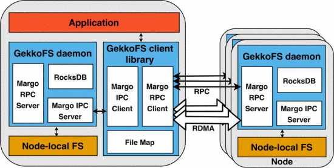

.. _sec-ref-filesystems:

File Systems and Storage
========================

In order to make use non-volatile memory (NVM) NextgenIO
makes use of a variety of file systems: `echofs`_ is used
by the Data Schduler for stage-in and stage-out operations,
`GekkoFS`_ will be able to be used by the Data Scheduler
to perform similar functions on multiple nodes 
simultaneously.

`dataClay`_ provides object class storage and can be used
by applications based on object oriented code directly.

If the platform mode is set to Memory Mode, NVDIMM 
namespaces reserved for App Direct mode require an 
interface to allow application Direct Access (DAX).
This can be in the form of a DAX enabled file system
mounted on the memory (`FSDAX`_) or Device DAX
(`DevDAX`_).

Direct Access (DAX)
~~~~~~~~~~~~~~~~~~~

FSDAX
-----

There are several file systems that allow for direct
access of application to the NVM, such as ext4, 
ext3, XFS, and ramfs. On NextgenIO the file system
used for FSDAX is ext4.
 
Once the file system is mounted on the NVM App
Direct partition (i.e. the namespace in the NVM 
reserved for direct access), applications can access
the memory with the use of the memory mapping function
( mmap( ) ) provided by the PMDK.

The burst-buffer echofs makes use of file system 
enabled DAX.

DevDAX
------

Device Direct Access implies that an application can 
perform byte-level operations in the NVM without 
intervention of a file system.

::

   Is there a specified method for this type of access?

echofs
~~~~~~

This file system allows for POSIX-like NVM based 
storage, and is used by the Data Scheduler to prefetch
(stage-in) data from the parallel file system 
(PFS/storage) to the computing nodes, and to write 
data from the computing nodes to the PFS upon completion
(stage-out). In contrast to GekkoFS, echofs is mounted
on single nodes.

echofs operates as a temporary, ad-hoc file system on
the computing nodes and on the PFS. It exists only as 
long as the batch job needs it. It hides any memory
hierarchies present in the computing node (see the section
on :ref:`sec-ref-memmodes`), and presents the node to the OS
as a virtual storage device with a single mount point.

Following the submission of a batch job, provided the 
required resources are available, the Data Scheduler creates
an instance on echofs on each of the allocated computing 
nodes. echofs prefetches the required data, based on the
job's data requirements passed on by the Scheduler.

Once stage-in has been completed, the batch job can 
execute. The application can access the loaded files
via standard POSIX I/O functions, making the system
compatible with legacy applications. The NVRAM will
function as a faster form of traditional storage.

Any new files created during the job are written into 
the NVM buffers, only transferring to storage 
(stage-out) once the job is completed. echofs therefore 
operates as a burst buffer.

::

   - Will the data scheduler use GekkoFS in stead of
     echofs?
   - Can a choice between the two be specfied by the
     users? (i.e.: do users need to understand the 
     difference between them?)

GekkoFS
~~~~~~~

This file system allows for POSIX-like NVM storage operations, 
and acts as an ad-hoc file-system for the lifetime of a single
batch job. GekkoFS can therefore operate as a burst-buffer, 
performing stage-in and stage-out data transfers for the scheduled
batch job. In these ways it is similar to echofs. 

There are important differences between the file-systems, though.
GekkoFS forms a collaborative burst buffer, acting as a single 
file system for all directly accessible memory on the nodes
allocated to the job by the Job Scheduler. Data and metadata is 
distributed in blocks over the available storage space.

The Gekko File System functions as an interposition library, which
redirects all file system operations requested by the job to 
file-system daemons running on the nodes. The system layout is 
illustrated in figure 1. 

The interception of file-system operation commands is performed by
the GekkoFS client, which is pre-loaded by the job application when
launched. The client also holds a file map, containing all data 
storage locations across the nodes. The client therefore maintains 
an overview of all data and can send requests to individual deamons
to perform I/O operations.

    **Figure 1** The architecture of the GekkoFS distributed file
    system. All comunication between the application and the FS runs
    via the GekkoFS client, which redirects commands to the daemons.
    The GekkoFS daemons run on each file system node. Image from [1]_

::

   - Is the POSIX interface ready?
   - What (if any) is the DAX filesystem on the nodes required by
     GekkoFS?  
   - Is the the file-map for the client stored in the memory of
     the login node?

.. [1] Vef, M.-A. et al., *GekkoFS - A Temporary Distributed File 
       System for HPC Applications*, CLUSTER (Proceedings) (2018)

dataClay
~~~~~~~~

dataClay is an object store designed to make use of the 
features of SCM. It can be accessed directly by applications 
written in an object-oriented programming language. Currently
Java and Python are the two languages suppored by DataClay.
A full description of the data store can be found in the 
`DataClay Documentation <https://www.bsc.es/research-and-
development/software-and-apps/software-list/dataclay/documentation>`_.

A main functionality of the data store is to allow users to
make any application created object persistent in memory. Storing
an object in this manner not only saves it for later use, but 
also allows the object to be called from other applications.

The structure of dataClay consists of two main components: a logic 
module and the data service. The logic module provides centralised
storage, handling the metadata for all objects and checking permissions
for user access to the objects stored in the data service. 

The data service handles the storage of the persistent objects, as
well as any execution requests involving these objects. The execution
request are expected to be mainly execution of mehods from the class
to which the given object belongs. 

dataClay can be called by any application written in the
supported languages, however specific effort has been made
to improve performance of dataClay in combination with 
:ref:`sec-ref-pycompss`.

**Overview of dataClay object methods**

+---------------------------------+------------------------------------------------------+
| obj.make_peristent( )           || Store obj in dataClay, create Object ID. This method|
|                                 || also allows the user to specify what language the   |
|                                 || object should be associated with.                   |
+---------------------------------+------------------------------------------------------+
| obj.get_location( )             || Return obj location in the data service (if a copy  |
|                                 || of obj exists, returns one random location          |
+---------------------------------+------------------------------------------------------+
| obj.get_all_locations( )        || Find all data service locations where obj or its    |
|                                 || its copies are stored                               |
+---------------------------------+------------------------------------------------------+
| obj.new_replicas( )             || Create a copy of obj                                |
+---------------------------------+------------------------------------------------------+

::

   - Are Java and Python still the two backends supported for 
     DataClay?
   - Does DataClay depend on FSDAX?

