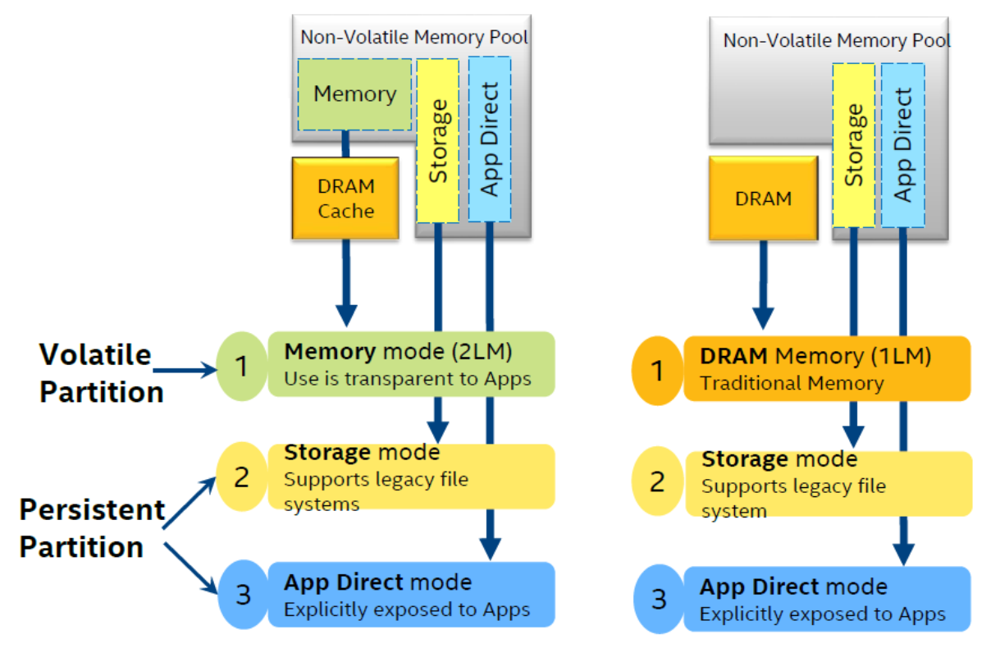

System Overview
===============

This section will provide an overview of the system hardware, as well as
a diagrammatic sketch of the sytem layout. 

There are multiple ways in which the new byte addressable storage class 
memory (SCM)can be applied, and the different modes each have specific
uses and user instructions associated with them. The various applications 
of the memory are summarised in the section `Memory Modes`_.

Hardware
~~~~~~~~

**Login/Management Node**:

- 2x Xeon Platinum 8260 24C 2.4GHz
- 6x 16GB DRAM
- 2x 256GB NVDIMM
- 3x SATA-SSD ~2TB

**Compute Node**:

- 2x Xeon Platinum 8260 24C 2.4GHz
- 12x 16GB DRAM
- 12x 256GB NVDIMM
- *No internal SSD/HDD*: remote boot

.. figure:: ../images/cpu_dram_nvram.png
    :align: center
    :scale: 55 % 
    :alt: diagramme of a single node

    **Figure 1** The structure of the Compute Nodes: two Cascade Lake
    CPUs, combining DRAM and NVRAM in each memory channel. DIMMs sharing the same 
    channel to the CPU will also share the channel's bandwidth.

.. _sec-ref-memmodes:

Memory Modes
~~~~~~~~~~~~

In general the SCM can operate in a variety of modes: as an extension of 
traditional DRAM, as storage, and as a new class of persistent memory (NVRAM). 
This means that in the NextgenIO system, the SCM can be applied in a number
of configurations.

The SCM is included in the system in the form of NVRAM DIMMs (NVDIMMs), and is
always combined with DRAM DIMMs (see Figure 1). The difference between configurations
lies in the modes in which the NVRAM is applied. At the platform level, nodes can
be booted in two different modes. Switching between platform modes requires
a reboot of the nodes. 

At the NVDIMM level the SCM can be partitioned, reserving sections of the SCM to 
operate in one of the modes listed above. This implies that different
memory modes can exist in different partitions on the same NVDIMM at the same time.
These partitions are managed by the memory controller, but a more abstract level
of access is made possible through the use of namespaces. The namespaces contain
the different memory modes available on the NVDIMM, and determine the way in which
the OS and applications see that particular memory partition. 

Namespaces are subdivisions of Memory Pools, which are BIOS mapped physical 
memory ranges. The Memory Pools are classed as either volatile or persistent, 
and switching between the two requires rebooting the node. Namespaces, on the other
hand, can be reallocated within existing Memory Pools without a reboot.

The choice of platform mode impacts the usage of the different reserved 
namespaces on the NVDIMM. The platform level modes are:

1. **Memory mode**: In Memory mode, also known as two-level memory mode, the byte-addressable persistent memory is transparent to applications and represents the main memory space, while DRAM effectively becomes the last level cache. In this mode, the persistent properties of the technology are not exploited because coherence between DRAM and persistent memory cannot be guaranteed. Applications do not have to be modified to use the persistent memory in this mode. All data objects are stored by default in the DCPMM and must be handled as volatile like DRAM data.
2. **App Direct mode**: In AppDirect mode, also referred to as one-level memory mode, the persistent memory is only accessible via direct load and store operations and its primary use is as very fast byte-addressable non- volatile local storage. In this mode, applications can only exploit the persistent memory either if they manage it directly or if system software provides an interface (e.g. through a file system that is mounted on the persistent memory). In this mode, the DRAM is available as low latency main memory. 

The functionality of the NVDIMMs under these different platform modes is
shown in schematic form in figure 2. The left side of the figure shows use
in Memory mode, and the right side use in App Direct mode. Note that the 
use of any storage namespace on the nodes is unaffected by the choice of
platform mode.

    **Figure 2** The different possible namespace partitions on the NVDIMMs
    (storage, space for Memory mode, and App Direct mode) and the way these
    partitions are visible to the OS and applications in the different
    platform modes.

The effect of the platform modes on NVDIMM usage can be further illustrated
with an example: consider an NVDIMM where half of the persistent memory 
space is reserved for App Direct use, and half is reserved for use in Memory
mode.

When booting the platform in Memory mode an application can see the full 
available NVRAM, but cannot see the DRAM. The DRAM is used as cache. The 
namespace reserved for App Direct needs to be made available by mounting
it with a file system (such as DAX, see :ref:`sec-ref-filesystems`). This
mode is illustrated in the diagram below, which shows a single NVDIMM 
(*top*) and DRAM DIMM (*bottom*).

.. raw:: html
    :file: ../images/NVDIMM_Memmode.html

When booting the platform in App direct mode, the NVDIMM namespace reserved
for Memory mode usage is not visible to the application, and cannot be accessed.
The App Direct reserved space on the NVDIMM functions as persistent memory
(NVRAM). The DRAM is directly available to the application, and is used as 
regular, low-latecy, memory. NVDIMM use in this mode is illustrated below.

.. raw:: html
    :file: ../images/NVDIMM_Appdirect.html

::

   Should we include 'striped persistent AppDirect'? 

Memory Configurations
---------------------

There is a large number of possible configurations of the system, as different
nodes can be set up with different uses of the NVRAM, and the space allocation
on the NVDIMMs can be different as well. The main setups used in the NextgenIO 
system are:

::

    There are multiple options, which ones should be included?

::

    Should it be possible for users to change the namespace partitions 
    on the NVDIMMs? If so, an explanation should be included here.

User control over the configuration in which the nodes are booted is
described in the section on the :ref:`sec-ref-scheduler`.

Layout
~~~~~~

A schematic overview of the NextgenIO system is shown in the diagram below. 
Access to the system is controlled via hydra-vpn, which connects to the 
system's two login nodes. The 34 computing nodes (CN) are accessed via an 
Omnipath Switch (OPA 1), which also connects to the storage (SS1 and SS2).

Note that all MPI communication runs over a *separate* Omnipath network, which 
is controlled by a second switch (OPA 2). 

.. raw:: html
    :file: ../images/hardware_diagram.html

